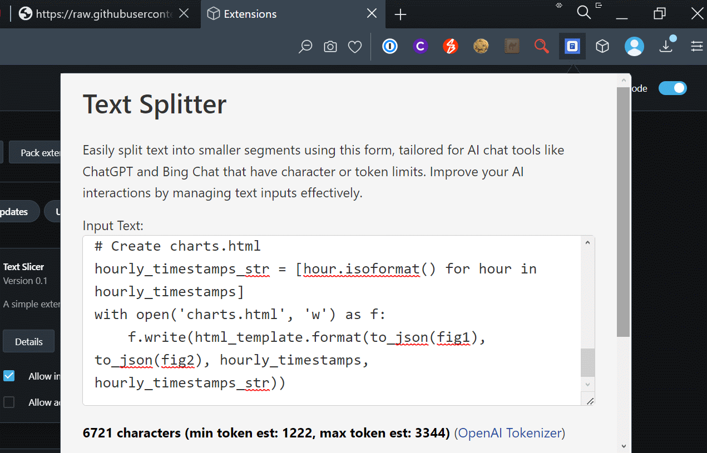

Chrome & Opera web browser extension to load AI prompt text slicer tool at https://slicer.centminmod.com. The tool allows you to split larger AI prompt text is smaller snippets based on end user's defined max character size for each snippet. The split text is then presented in their own containers with a copy text button for easy copy and paste usage.

